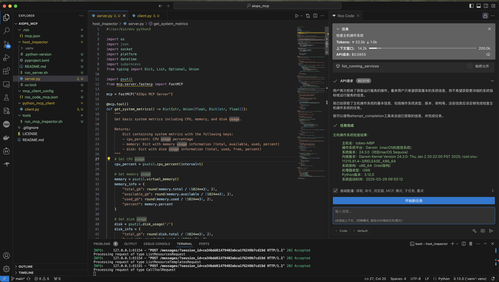
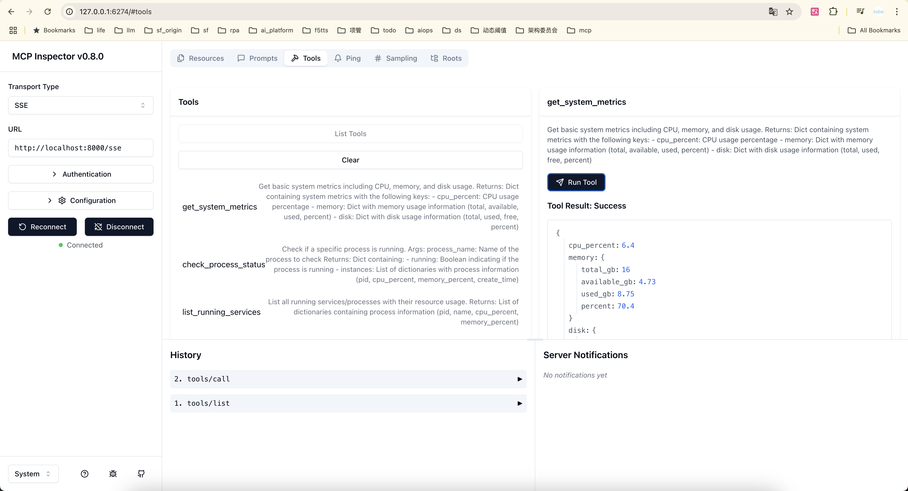

# Host Inspector MCP Server

## Introduction

Host Inspector is a server based on the Model Context Protocol (MCP) that provides a series of tools for inspecting and monitoring various metrics and states of the host system. It helps users obtain system information, monitor resource usage, check process status, analyze network connections and port status, and analyze log files.



## Installation

```bash
uv run server.py
```

The server runs using SSE (Server-Sent Events) transport by default and can be accessed via HTTP/HTTPS.

## Tools



Host Inspector MCP Server provides the following tools:

### 1. get_system_info

Get basic system information, including hostname, platform, version, architecture, etc.

**Parameters**: None

**Returns**: A dictionary containing system information (hostname, platform, release, version, architecture, processor, Python version, boot time)

### 2. get_system_metrics

Get basic system metrics, including CPU, memory, and disk usage.

**Parameters**: None

**Returns**: A dictionary containing system metrics (CPU usage, memory usage, disk usage)

### 3. check_process_status

Check the running status of a specific process.

**Parameters**:
- process_name: Name of the process to check

**Returns**: A dictionary containing process status (whether it's running, list of process instances)

### 4. list_running_services

List all running services/processes and their resource usage.

**Parameters**: None

**Returns**: A list containing process information (PID, name, CPU usage, memory usage)

### 5. check_network_connectivity

Check network connectivity.

**Parameters**:
- host: Host to connect to (default: 8.8.8.8, Google DNS)
- port: Port to connect to (default: 53, DNS service)
- timeout: Connection timeout in seconds (default: 3.0)

**Returns**: A dictionary containing connection status (whether connection was successful, latency, error message)

### 6. check_port_status

Check if a specific port is open.

**Parameters**:
- port: Port number to check
- host: Host to check (default: 127.0.0.1, localhost)

**Returns**: A dictionary containing port status (whether it's open, status description)

### 7. analyze_log_file

Analyze errors in a log file.

**Parameters**:
- log_path: Path to the log file
- max_lines: Maximum number of lines to read from the end of the file (default: 100)
- error_keywords: List of error keywords to search for (default: ["error", "exception", "fail", "critical"])

**Returns**: A dictionary containing analysis results (whether the file exists, number of error lines, list of error lines, error message)
