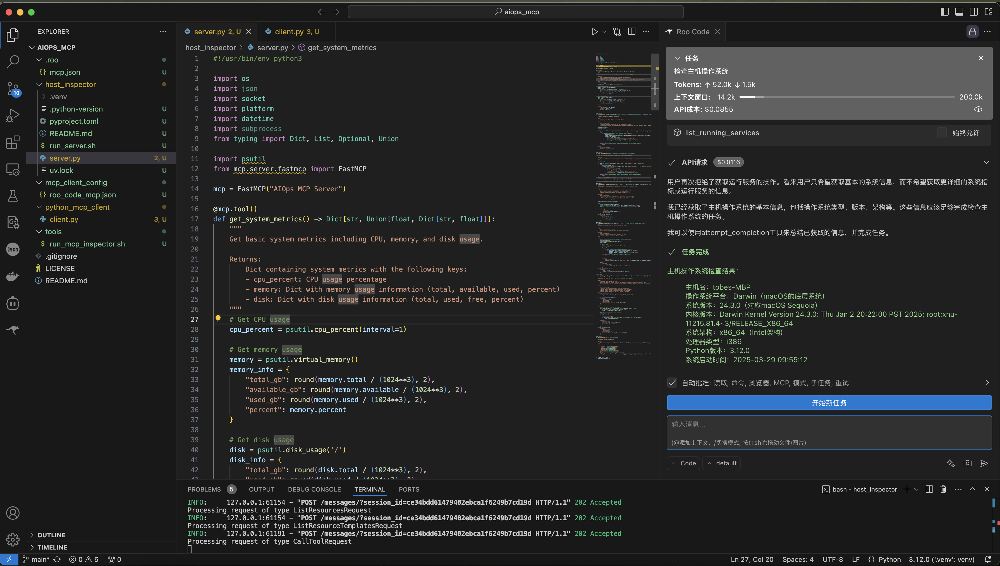
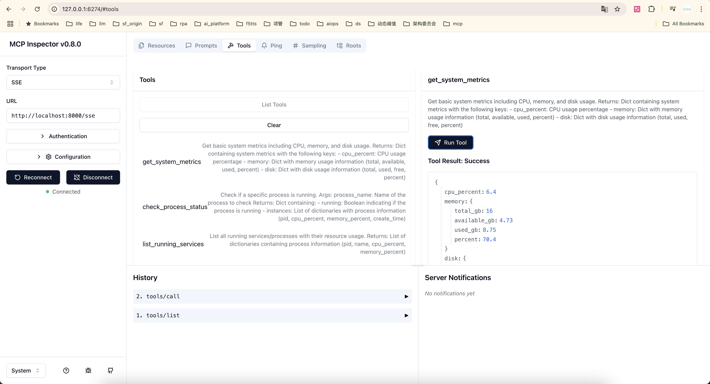

# Host Inspector MCP Server

## 介绍

Host Inspector 是一个基于 Model Context Protocol (MCP) 的服务器，提供了一系列工具用于检查和监控主机系统的各种指标和状态。它可以帮助用户获取系统信息、监控资源使用情况、检查进程状态、分析网络连接和端口状态，以及分析日志文件等。



## 安装

```bash
uv run server.py
```

服务器默认使用SSE（Server-Sent Events）传输方式运行，可以通过HTTP/HTTPS进行访问。

## 工具



Host Inspector MCP Server提供以下工具：

### 1. get_system_info

获取基本系统信息，包括主机名、平台、版本、架构等。

**参数**：无

**返回**：包含系统信息的字典（主机名、平台、发行版、版本、架构、处理器、Python版本、启动时间）

### 2. get_system_metrics

获取系统基本指标，包括CPU、内存和磁盘使用情况。

**参数**：无

**返回**：包含系统指标的字典（CPU使用率、内存使用情况、磁盘使用情况）

### 3. check_process_status

检查特定进程的运行状态。

**参数**：
- process_name：要检查的进程名称

**返回**：包含进程状态的字典（是否运行、进程实例列表）

### 4. list_running_services

列出所有正在运行的服务/进程及其资源使用情况。

**参数**：无

**返回**：包含进程信息的列表（PID、名称、CPU使用率、内存使用率）

### 5. check_network_connectivity

检查网络连接性。

**参数**：
- host：要连接的主机（默认：8.8.8.8，Google DNS）
- port：要连接的端口（默认：53，DNS服务）
- timeout：连接超时时间（默认：3.0秒）

**返回**：包含连接状态的字典（是否连接成功、延迟、错误信息）

### 6. check_port_status

检查特定端口是否开放。

**参数**：
- port：要检查的端口号
- host：要检查的主机（默认：127.0.0.1，本地主机）

**返回**：包含端口状态的字典（是否开放、状态描述）

### 7. analyze_log_file

分析日志文件中的错误。

**参数**：
- log_path：日志文件路径
- max_lines：从文件末尾读取的最大行数（默认：100）
- error_keywords：要搜索的错误关键词列表（默认：["error", "exception", "fail", "critical"]）

**返回**：包含分析结果的字典（文件是否存在、错误行数、错误行列表、错误信息）
